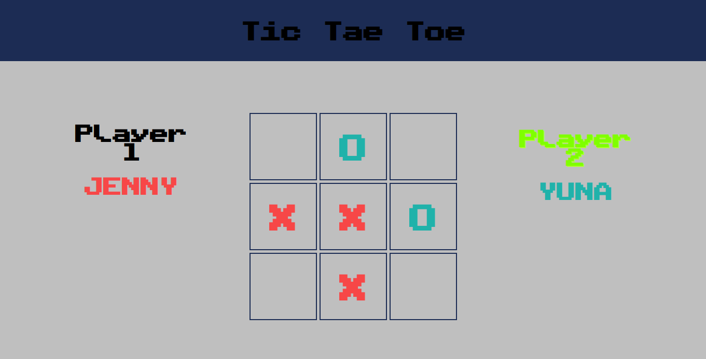

# Tic Tac Toe

> Recreate a classic Tic Tac Toe game.
> Live demo [_here_](https://nabelk.github.io/tic-tac-toe/).

## Table of Contents

-   [General Info](#general-information)
-   [Technologies Used](#technologies-used)
-   [Features](#features)
-   [Learning Experiences](#learning-experiences)
-   [Screenshots](#screenshots)
-   [Room for Improvement](#room-for-improvement)
-   [Contact](#contact)

## General Information

-   The project is a part of The Odin Project: Full Stack JavaScript.
-   The purpose of the project is to fully design using Factory Functions And The Module Pattern.
-   It also has a little global code.

## Technologies Used

-   HTML
-   CSS
-   Javascript

## Features

-   Sound Effects
-   Responsive design (web, tablet & mobile)

## Learning Experiences

-   By completing this project, I get to understand on how developer can create something from nothing.

## Screenshots

## Room for Improvement

-   Create an unbeatable AI

## Contact

Created by [@nabelk](https://www.linkedin.com/in/nabil-khalid-36791a241/) - feel free to contact me!
